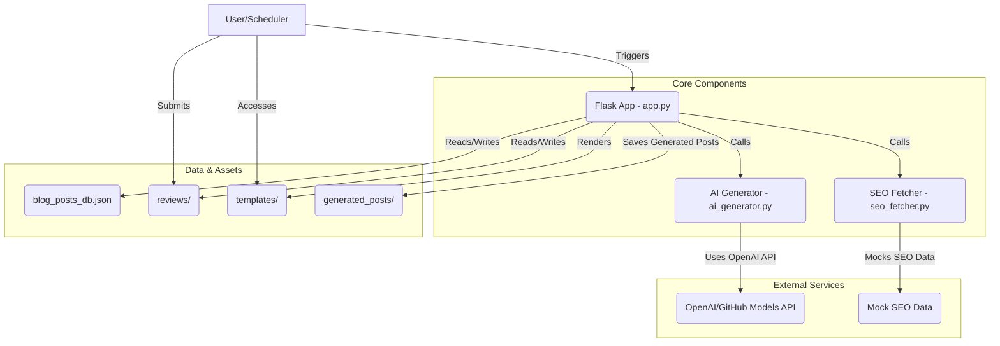

# AI-Powered Blog Post Generator

This Flask application automatically generates SEO-optimized blog posts using OpenAI's GPT model. It includes a daily scheduler to automatically generate posts for predefined keywords.

## Table of Contents

1. [Features](#features)
2. [Architecture](#architecture)
3. [Component Breakdown](#component-breakdown)
4. [Project Setup](#project-setup)
5. [Usage](#usage)
6. [API Endpoints](#api-endpoints)
7. [Customization](#customization)
8. [Error Handling](#error-handling)
9. [License](#license)

---


## Features

- Generate blog posts from keywords using OpenAI's GPT model
- Mock SEO data generation (search volume, keyword difficulty, CPC)
- Daily automated post generation
- REST API endpoint for on-demand post generation
- Automatic affiliate link placeholder replacement
- Markdown-formatted output
- User review submission for generated posts
- Dynamic post viewing with integrated SEO data and sources
- Options to delete individual or all generated posts

## Project Design

The AI-Powered Blog Post Generator is designed with a clear separation of concerns, leveraging Flask for web functionalities, `apscheduler` for background tasks, and dedicated modules for AI generation and SEO data handling. The application follows a Model-View-Controller (MVC) like pattern where `app.py` acts as the controller, `templates/` provide the views, and `blog_posts_db.json` along with the AI/SEO modules serve as the model. This modular approach enhances maintainability, scalability, and testability.

### Architecture



### Component Breakdown:

-   **`app.py` (Flask Application)**:
    -   The main entry point of the application, responsible for routing, handling HTTP requests, and coordinating different modules.
    -   Manages the daily blog post generation scheduler.
    -   Handles rendering of web pages (`index.html` for listing posts, `post.html` for individual posts).
    -   Manages saving and loading blog posts from `blog_posts_db.json`.
    -   Processes user reviews, saving them to the `reviews/` directory.
    -   Exposes API endpoints for on-demand post generation, and post management (deletion).
    -   Sanitizes keywords for safe use in filenames and database keys.
    -   Extracts titles from Markdown content for display.

-   **`ai_generator.py` (AI Blog Post Generator)**:
    -   Interacts with the OpenAI (or GitHub Models) API to generate blog post content.
    -   Constructs a detailed prompt, incorporating SEO metrics, content structure requirements, writing guidelines, and special instructions to guide the AI model.
    -   Handles error logging for API calls.
    -   Includes a `check_connection` function to verify API connectivity.

-   **`seo_fetcher.py` (SEO Data Fetcher)**:
    -   Provides mock SEO data (search volume, keyword difficulty, average CPC) for a given keyword.
    -   Designed to be easily replaceable with a real SEO API integration in a production environment.

-   **`blog_posts_db.json`**:
    -   A JSON file used as a simple key-value store for saving generated blog posts. The keys are sanitized keywords and values are the Markdown content of the blog posts.

-   **`generated_posts/`**:
    -   Directory where generated blog posts *could* be saved as individual Markdown files, although the current implementation primarily uses `blog_posts_db.json` for storage and retrieval for dynamic content. This directory serves as a potential artifact storage location.

-   **`reviews/`**:
    -   Directory where user reviews for each blog post are stored as JSON files (e.g., `keyword_reviews.json`).

-   **`templates/`**:
    -   Contains Jinja2 HTML templates (`index.html`, `post.html`) for rendering the web interface.

## Application Working Style

The application operates in two primary modes: scheduled daily generation and on-demand generation via a web interface or API.

1.  **Daily Scheduled Post Generation**:
    *   The `BackgroundScheduler` in `app.py` is configured to trigger the `generate_daily_post` function automatically at a predefined time (defaulting to midnight).
    *   This function calls `get_seo_data` for a fixed keyword (e.g., "wireless earbuds") and then uses `generate_blog_post` to create the content.
    *   The generated post is saved into `blog_posts_db.json`.

2.  **On-Demand Post Generation**:
    *   Users can request a blog post for a specific keyword through the `/generate` API endpoint.
    *   The application fetches mock SEO data, generates the post using the AI model, saves it, and returns the Markdown and HTML content.

3.  **Web Interface**:
    *   The home page (`/`) dynamically lists all generated blog posts by loading them from `blog_posts_db.json`.
    *   Clicking on a post links to a detailed view (`/post/<keyword>`), which renders the Markdown content as HTML, displays SEO data, extracted sources, and any existing user reviews.
    *   Users can submit reviews via a form on the post-viewing page, which are then saved to the `reviews/` directory.

4.  **Data Management**:
    *   Blog posts are centrally stored in `blog_posts_db.json` for efficient retrieval and management.
    *   Reviews are stored in separate JSON files within the `reviews/` directory, named based on the associated blog post's keyword.
    *   The application includes endpoints for deleting individual posts or all posts and their related reviews, ensuring data hygiene.

## Detailed Method Documentation

### `app.py` Methods

-   **`to_localized_string_filter(value)`**:
    *   **Purpose**: A custom Jinja2 filter to format numbers with a comma as a thousand separator for better readability in HTML templates.
    *   **Arguments**: `value` (int/float) - The number to be formatted.
    *   **Returns**: (str) - The localized string representation of the number (e.g., "10,000").

-   **`load_blog_posts()`**:
    *   **Purpose**: Loads all stored blog posts from `blog_posts_db.json`.
    *   **Arguments**: None.
    *   **Returns**: (dict) - A dictionary where keys are sanitized keywords and values are the Markdown content of the blog posts. Returns an empty dictionary if the file doesn't exist or an error occurs.

-   **`save_blog_posts(posts_data)`**:
    *   **Purpose**: Saves the current state of blog posts to `blog_posts_db.json`.
    *   **Arguments**: `posts_data` (dict) - The dictionary of blog posts to be saved.
    *   **Returns**: None. Handles exceptions during file writing.

-   **`sanitize_keyword(keyword)`**:
    *   **Purpose**: Cleans and normalizes a given keyword to make it suitable for use as a filename or a dictionary key. It converts to lowercase, replaces spaces/special characters with hyphens, and removes leading/trailing/multiple hyphens.
    *   **Arguments**: `keyword` (str) - The input keyword.
    *   **Returns**: (str) - The sanitized version of the keyword. Falls back to "generated-post" if the input sanitizes to an empty string.

-   **`extract_title_from_markdown(markdown_content)`**:
    *   **Purpose**: Extracts the main H1 title (e.g., `# My Title`) from a Markdown string.
    *   **Arguments**: `markdown_content` (str) - The Markdown text of a blog post.
    *   **Returns**: (str) - The extracted title. Returns "Untitled Post" if no H1 is found within the first 15 lines.

-   **`generate_daily_post()`**:
    *   **Purpose**: This function is scheduled to run daily (e.g., at midnight) to automatically generate a new blog post for a predefined keyword.
    *   **Arguments**: None.
    *   **Returns**: None. Logs success or error messages.

-   **`home()` (`@app.route('/')`)**:
    *   **Purpose**: Renders the main index page of the application, displaying a list of all available blog posts. Posts are sorted in descending order (latest first).
    *   **Arguments**: None (Flask route function).
    *   **Returns**: (rendered template) - `index.html` with a list of post dictionaries (containing `filename` and `title`).

-   **`view_post(filename)` (`@app.route('/post/<filename>')`)**:
    *   **Purpose**: Renders a single blog post based on its keyword (which is used as the filename). It converts Markdown to HTML, extracts sources, fetches SEO data, and loads associated reviews.
    *   **Arguments**: `filename` (str) - The sanitized keyword representing the post to view.
    *   **Returns**: (rendered template) - `post.html` with the post content, SEO data, sources, and reviews. Returns a 404 error if the post is not found.

-   **`submit_review(filename)` (`@app.route('/submit_review/<filename>', methods=['POST'])`)**:
    *   **Purpose**: Handles the submission of new user reviews for a specific blog post. It saves the review data to a JSON file associated with the post.
    *   **Arguments**: `filename` (str) - The sanitized keyword of the post being reviewed.
    *   **Returns**: (redirect) - Redirects back to the `view_post` page for the same post after processing.

-   **`generate_post()` (`@app.route('/generate', methods=['GET'])`)**:
    *   **Purpose**: An API endpoint to generate a blog post on demand for a given keyword.
    *   **Arguments**: `keyword` (query parameter) - The keyword for which to generate the post.
    *   **Returns**: (JSON response) - A JSON object containing the generated blog post in Markdown and HTML formats, and its sanitized filename. Returns a 400 error if no keyword is provided.

-   **`delete_all_posts()` (`@app.route('/delete_all_posts', methods=['POST'])`)**:
    *   **Purpose**: Deletes all generated blog posts from `blog_posts_db.json` and all associated review files from the `reviews/` directory.
    *   **Arguments**: None (Flask route function).
    *   **Returns**: (redirect) - Redirects to the home page after deletion.

-   **`delete_post(keyword)` (`@app.route('/delete_post/<keyword>', methods=['POST'])`)**:
    *   **Purpose**: Deletes a specific blog post and its associated review file.
    *   **Arguments**: `keyword` (path parameter) - The sanitized keyword of the post to be deleted.
    *   **Returns**: (redirect) - Redirects to the home page after deletion.

-   **`view_reviews(keyword)` (`@app.route('/reviews/<keyword>')`)**:
    *   **Purpose**: (Currently unused in the web interface, but available) - Designed to display reviews for a specific keyword.
    *   **Arguments**: `keyword` (path parameter) - The sanitized keyword of the post whose reviews are to be viewed.
    *   **Returns**: (JSON response) - A JSON object containing the reviews for the specified keyword.

### `ai_generator.py` Methods

-   **`generate_blog_post(keyword: str, seo_data: Dict[str, float]) -> str`**:
    *   **Purpose**: Orchestrates the interaction with the OpenAI (or GitHub Models) API to generate a blog post. It constructs a comprehensive prompt using the provided keyword and SEO data, and then calls the API.
    *   **Arguments**:
        *   `keyword` (str): The main topic for the blog post.
        *   `seo_data` (Dict[str, float]): A dictionary containing SEO metrics (search volume, keyword difficulty, avg_cpc).
    *   **Returns**: (str) - The generated blog post content in Markdown format. Raises an exception if generation fails.

-   **`check_connection()`**:
    *   **Purpose**: Verifies connectivity to the OpenAI API endpoint by making a small, non-resource-intensive request (e.g., listing models).
    *   **Arguments**: None.
    *   **Returns**: (bool) - `True` if the connection is successful, `False` otherwise. Logs any connection errors.

### `seo_fetcher.py` Methods

-   **`get_seo_data(keyword: str) -> Dict[str, float]`**:
    *   **Purpose**: A mock implementation to provide SEO metrics for a given keyword. In a real-world scenario, this function would integrate with an actual SEO API (e.g., SEMrush, Ahrefs, Moz).
    *   **Arguments**: `keyword` (str) - The keyword for which to generate mock SEO data.
    *   **Returns**: (Dict[str, float]) - A dictionary containing randomly generated `search_volume`, `keyword_difficulty`, and `avg_cpc`.

## Project Setup

This section provides a complete guide to setting up and running the AI-Powered Blog Post Generator on your local machine.

### Prerequisites

Before you begin, ensure you have the following installed:

-   **Python 3.8 or higher**: Download from [python.org](https://www.python.org/downloads/).
-   **OpenAI API key (or GitHub token for GitHub Models API)**: You'll need an API key to access the AI generation capabilities.
    *   For OpenAI, get your key from the [OpenAI API dashboard](https://platform.openai.com/account/api-keys).
    *   If using GitHub Models, ensure you have a GitHub token with appropriate permissions.

### Installation Steps

Follow these steps to get the application running:

1.  **Clone the repository**:
    Open your terminal or command prompt and run the following command to download the project files:
    ```bash
    git clone https://github.com/yourusername/ai-blog-generator-interview-Vishwa_Sai_Challa.git
    cd ai-blog-generator-interview-Vishwa_Sai_Challa
    ```

2.  **Create and activate a virtual environment**:
    It's highly recommended to use a virtual environment to manage project dependencies and avoid conflicts with other Python projects.
    ```bash
    python -m venv venv
    ```
    **Activate the virtual environment**:
    *   **On Windows (Command Prompt/PowerShell)**:
        ```bash
        .\venv\Scripts\activate
        ```
    *   **On Unix or MacOS**:
        ```bash
        source venv/bin/activate
        ```

3.  **Install dependencies**:
    With your virtual environment activated, install all required Python packages using pip:
    ```bash
    pip install -r requirements.txt
    ```

4.  **Configure API Key (.env file)**:
    Create a new file named `.env` in the root directory of your project (the same directory as `app.py`). Add your OpenAI API key to this file in the following format:
    ```
    OPENAI_API_KEY=your_api_key_here
    ```
    *Note: The `ai_generator.py` currently has a hardcoded `api_key` and `server_url` for GitHub Models. For a production setup with OpenAI, ensure `OPENAI_API_KEY` is correctly set in `.env` and `ai_generator.py` uses `os.getenv("OPENAI_API_KEY")` if you are switching to OpenAI's official API. If you intend to use the GitHub Models endpoint, ensure the hardcoded API key and endpoint are correct.*

## Usage

### Running the Application

To start the Flask application, ensure your virtual environment is activated and run:
```bash
python app.py
```

The application will:
-   Start the Flask server on `http://localhost:5000`.
-   Initialize the daily scheduler to generate posts at midnight (configurable in `app.py`).
-   Create `generated_posts` and `reviews` directories if they don't exist.

### Web Interface

Once the application is running, open your web browser and navigate to `http://localhost:5000`.

-   **Home Page (`/`)**: Displays a list of all generated blog posts, sorted by keyword (most recent first).
-   **View Post (`/post/<keyword>`)**: Shows the full content of a specific blog post, including its extracted title, SEO data, any extracted sources, and allows users to submit reviews.
-   **Submit Review (`/submit_review/<keyword>`)**: Handles the submission of user reviews for a specific post.

### API Endpoints

The application exposes several REST API endpoints for interaction:

#### Generate Blog Post
This endpoint allows you to generate a blog post on demand.
```
GET /generate?keyword=your_keyword
```

**Example Request (using curl)**:
```bash
curl "http://localhost:5000/generate?keyword=wireless%20earbuds"
```

**Example JSON Response**:
```json
{
    "blog_post": "# Generated blog post content in Markdown...",
    "blog_post_html": "<p>Generated blog post content in HTML...</p>",
    "filename": "wireless-earbuds"
}
```

#### Delete All Posts
This endpoint will delete all blog posts from `blog_posts_db.json` and associated review files from the `reviews/` directory.
```
POST /delete_all_posts
```
**Example Request (using curl)**:
```bash
curl -X POST http://localhost:5000/delete_all_posts
```

#### Delete Specific Post
This endpoint deletes a specific blog post and its associated reviews based on the provided keyword.
```
POST /delete_post/<keyword>
```
**Example Request (using curl)**:
```bash
curl -X POST http://localhost:5000/delete_post/wireless-earbuds
```

### Generated Posts

The application automatically generates posts daily for the predefined keyword ("wireless earbuds" by default). Generated posts are saved in the `blog_posts_db.json` and are dynamically displayed through the web interface.

## Customization

-   To change the default keyword for daily generation, modify the `keyword` variable in the `generate_daily_post()` function in `app.py`.
-   To adjust the scheduling time, modify the cron schedule in `app.py` (e.g., `trigger='cron', hour=0, minute=0` for midnight).
-   To customize the blog post generation prompt, edit the prompt template in `ai_generator.py`.
-   To integrate a real SEO API, replace the `get_seo_data` function in `seo_fetcher.py`.
-   To change the OpenAI model used, modify the `model_name` variable in `ai_generator.py`.

## Error Handling

The application includes error handling for:
-   Missing API keys
-   OpenAI API errors
-   Invalid keywords (sanitization)
-   File system operations (reading/writing JSON files)

## License

MIT License 